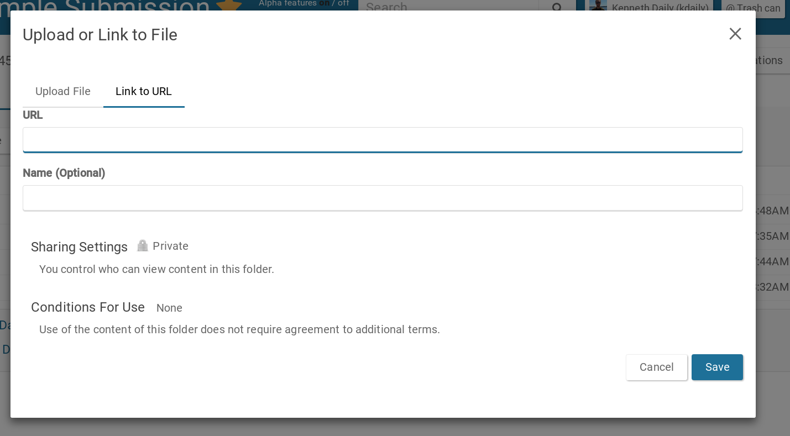

```{r loadlibs, echo=FALSE, warning=FALSE, message=FALSE, error=FALSE, eval=TRUE}
library(knitr)
library(dplyr)

library(synapseClient)
synapseLogin()

# control what is output when knitting
# These can be overridden in specific chunks
knitr::opts_chunk$set(
  echo=FALSE,
  warning=FALSE,
  message=FALSE,
  error = FALSE,
  tidy = FALSE)
```

```{r include=TRUE, eval=FALSE}
library(synapseClient)
synapseLogin()

myFileName <- "index.Rmd"
repo <- rGithubClient::getRepo("Sage-Bionetworks/20151027_U4C")
thisScript <- rGithubClient::getPermlink(repo, 
                                         myFileName)

thisFile <- File(thisScript, name="U4C Webinar - Project Submission Slides",
                 parentId="syn4597738", synapseStore=FALSE)
thisFile <- synStore(thisFile)
 
knit2synapse::knitfile2synapse(file = myFileName,
                               owner = thisFile@properties$id, 
                               overwrite=T)

```

---


<br/>

* A workspace that allows you to **aggregate,** **describe,** and **share** research
* A tool to **improve reproducibility** of data intensive science, recording progress as you work
* A set of **living research projects** enabling contribution to large-scale collaborative solutions
* Freely available to anyone

<div class="notes">
Enabling researchers to contribute to large-scale collaborative science across locales

Why use Synapse?

1. It's free!
1. Share data and results
1. Collaborate across a Team
1. Keep track of data processing steps
1. Get attribution for work performed
</div>

## Synapse for U4C { .flexbox .vcenter }

Up for a Challenge **requires** reproducibility and sharing of results and **encourages** collaboration across disciplines.

<br/>

**These are the things that Synapse was designed to support.**

<br/>

<div class="centered">

</div>

## Synapse for U4C | Creating a Submission

We assume (and will not cover today) that:

1. You have registered for a free [Synapse account](https://www.synapse.org)
1. You have [registered for the Challenge](https://www.synapse.org/#!Synapse:syn3157598/wiki/232614)
1. You have (optionally) [formed and registered a Team](https://www.synapse.org/#!Synapse:syn3157598/wiki/232615)
1. You are familiar with the [rules for the Challenge](https://www.synapse.org/#!Synapse:syn3157598/wiki/232619)
1. You have [access to dbGaP data](https://www.synapse.org/#!Synapse:syn3157598/wiki/232632)


<div class="centered">
**All information can be found at the Challenge website:**

https://www.synapse.org/upforachallenge
</div>

## Synapse for U4C | Creating a Submission

<div class="centered">
https://www.synapse.org/upforachallenge
</div>

<br/>

1. Create a new Synapse Project
1. Find the [Project Submission Template](https://www.synapse.org/#!Synapse:syn4935464/wiki/235791)
1. Get the Wiki text from the template and copy it to your own Project Wiki
1. Create necessary Folders
1. Edit your Project Wiki (and other Project content) with your own content

<br/>

<div class="centered">
Detailed information about these steps is available in section<br/>[4.5 - How to Submit A Challenge Entry](https://www.synapse.org/#!Synapse:syn3157598/wiki/232617).
</div>

## Synapse for U4C | Creating a Submission Live Demo { .smaller }

<center>
Details are available at
[4.5 - How to Submit A Challenge Entry](https://www.synapse.org/#!Synapse:syn3157598/wiki/232617)
</center>

<br/>

1. Make sure you are logged into Synapse (check upper left)
1. Start at [4.5 - How to Submit A Challenge Entry](https://www.synapse.org/#!Synapse:syn3157598/wiki/232617)
1. Click Create Project Button and create a new project (this takes to a blank project)
1. Favorite it (click star) to easily find it again!
1. Optionally, Share it with your team (if you have one, will share w/ U4C test team)
1. Find the [Project Submission Template](https://www.synapse.org/#!Synapse:syn4935464/wiki/235791)
1. Copy the wiki text to your own Project level Wiki
1. Create two folders - one for Abstract and one for Code
1. Edit the Wiki on the Abstract folder to contain the text of your Abstract
1. Edit the Project-level Wiki with the content of your Submission (many features in Synapse to make this proj sharable and reproducible, talk about those now)

<div class="notes">
1. Everything created gets a unique ID (synXXXXX) - can refer to any Project, File, or Folder that way
</div>

## Synapse for U4C | Creating a Submission

<br/>

Before we explore an [Example Project Submission](https://www.synapse.org/#!Synapse:syn4154450/), I'll discuss features provided by Synapse to create a sharable, reusable, and reproducible Submission.

## Synapse Features | Wikis


- We use a simple text-based formatting system called [Markdown](https://www.synapse.org/#!Synapse:syn2467792)
- You will use this to edit your Project Wiki with the content of your Submission

<div class="centered">

</div>

<div class="notes">
Since the Synapse web site is probably most often used, we have flexible options for describing the data in a Project
</div>

## Synapse features | File storage { .smaller }


<div class="centered">
<a href="https://www.synapse.org/#!Synapse:syn4154450/files/"></a>
</div>

<div class="notes">
* Agnostic to storage solution (cloud, local server, remote server)
* **New!** - your own Amazon S3 buckets
</div>

## Synapse features | Storing data using the web interface { .flexbox .centered }

<div class="centered">

</div>

## Synapse features | Linking to dbGaP data { .smaller }

<div class="centered">

<span class="red">**For this Challenge, dbGaP data cannot be uploaded to Synapse.**</span>

However, a file can be linked instead of stored, and can still be used by many features of Synapse.


</div>

## Synapse features | Certified user


<br/>

**In order to add content to Synapse, [Take the Quiz](https://www.synapse.org/#!Quiz:Certification) to become a Certified User!**

## Synapse features | Annotations { .smaller }

* Easily curate and search for specific files and folders
* Completely user-driven
* A querying system to search

[Example File with annotations](https://www.synapse.org/#!Synapse:syn4157529)

<br/>

<div class="centered">

</div>

## Synapse features | Provenance


**Provenance = keeping track of inputs, outputs, and the code to run**

- Who did what to a file and when?
- Retrieve in a computer-friendly manner
- Do it while you work or later in the browser

## Synapse features | [Visualizing provenance in the browser](https://www.synapse.org/#!Synapse:syn4157529) { .smaller }

<div class="centered">

</div>

## Synapse features | Synapse API
<div class="centered">
All features in the web browser are available from<br/>[`R`](https://www.synapse.org/#!Help:RClient), [`Python`](http://python-docs.synapse.org/), and the [`Command line`](https://www.synapse.org/#!Help:CommandLineClient) for use in an<br/>automated, reproducible manner.


</div>

<div class="notes">
Nearly all features of available in the web browser are available in the R and Python clients!
* Project, File, Folder creation
* Storing and linking files
* Manipulating annotations
* Manipulating provenance
* Creating and updating tables
* Making Wikis
</div>

## Synapse for U4C | Example Project Submission { .smaller }

Let's explore the [Example Project Submission](https://www.synapse.org/#!Synapse:syn4154450/) to see how to the features of Synapse in action.

## Synapse for U4C | Example Project Submission Live Demo { .smaller }

An [Example Project Submission](https://www.synapse.org/#!Synapse:syn4154450/) to highlight ways that you can use the features of Synapse to make your submission reproducible and sharable.

1. Note that you can see how to implement any of the features described in the example project by clicking "View Wiki Source"
1. Highlight examples on putting data (including dbGaP data linked) including code
1. Go to Data folder, show table
1. Go to dbGaP data folder and file, show that the file is not uploaded
1. Back at example project, show provenance examples

## Example public Projects | For inspiration of Synapse features

- [AMP AD Knowledge Portal](https://www.synapse.org/#!Synapse:syn2580853)
- [Progenitor Cell Biology Consortium](https://www.synapse.org/#!Synapse:syn1773109)
- [JWGray Breast Cancer Cell Line Panel](https://www.synapse.org/#!Synapse:syn2346643)

<br/>

For more, see [Research Communities](https://www.synapse.org/#!Synapse:syn3722562/wiki/219258) and [Open Resources](https://www.synapse.org/#!Synapse:syn3722562/wiki/219259).

## Synapse for U4C | Submitting a Challenge Entry { .flexbox .centered }

<center>
See [4.5 - How to Submit A Challenge Entry](https://www.synapse.org/#!Synapse:syn3157598/wiki/232617), "How to Submit"
</center>

## Synapse for U4C | Submitting a Challenge Entry Live Demo { .smaller }

1. Go to [4.5 - How to Submit A Challenge Entry](https://www.synapse.org/#!Synapse:syn3157598/wiki/232617), "How to Submit"
1. Click `Submit to Challenge` button
1. Find your Project
1. Choose the U4C challenge
1. Provide a name (same as your Project title)
1. Choose submitting as indiv or team (I'll choose team)
1. Submit!
1. Check that your submission appears in the submissions list
1. `Share` your project with the `NCI U4C Evaluation Panel` - they require view permissions
1. Potentially share your project with the public, whenever you want!

## Documentation and examples

- [Up For a Challenge Synapse Project (syn4212404)](https://www.synapse.org/upforachallenge)
- [Synapse Tutorial](https://www.synapse.org/#!Help:GettingStarted)
- [U4C-Specific Support Forums](http://support.sagebase.org/sagebase/products/sagebase_up_for_a_challenge)
- [General Synapse Support Forums](http://support.sagebase.org/sagebase)
- [R](http://r-docs.synapse.org/) [client](https://www.synapse.org/#!Help:RClient)
- [Python](http://python-docs.synapse.org/) [client](https://www.synapse.org/#!Help:PythonClient)
- [Command line](http://python-docs.synapse.org/CommandLineClient.html) [client](https://www.synapse.org/#!Help:CommandLineClient)
- [github:Sage-Bionetworks/synapseTutorials](https://github.com/Sage-Bionetworks/synapseTutorials)
- [github:Sage-Bionetworks/knit2synapse](https://github.com/Sage-Bionetworks/knit2synapse)

## Thank you! | Questions?

- Leah Mechanic, [National Cancer Institute](http://epi.grants.cancer.gov/staff/mechanic.html)
- Elizabeth Gillanders, [National Cancer Institute](http://epi.grants.cancer.gov/staff/gillanders.html)
- Sara Lindström, [University of Washington](http://sph.washington.edu/faculty/fac_bio.asp?url_ID=Lindstroem_Sara)
- Thea Norman, [Sage Bionetworks](https://www.sagebase.org/)
- Solly Sieberts, [Sage Bionetworks](https://www.synapse.org/#!Profile:273959)
- Jay Hodgson, [Sage Bionetworks](https://www.synapse.org/#!Profile:345424)

## Advanced Synapse features

* Tables
* More annotations
* RMarkdown to Synapse Wikis (knit2synapse)

## Synapse features | Structured data tables

* Data that is queryable, but also enforces the data type is stored in each column
* Can share a [link](https://www.synapse.org/#!Synapse:syn3156503/tables/query/eyJsaW1pdCI6MjUsICJzcWwiOiJTRUxFQ1QgVUlELGJpb2xvZ2ljYWxTYW1wbGVOYW1lLERpZmZuYW1lX3Nob3J0LHBhc3NfcWMsQ2VsbF9UeXBlIEZST00gc3luMzE1NjUwMyBXSEVSRSBwdWJsaWM9dHJ1ZSIsICJpc0NvbnNpc3RlbnQiOnRydWUsICJvZmZzZXQiOjB9) to the results of a specific query.
* Can use results in Wiki, from programmatic clients

Example query:

```
SELECT UID,biologicalSampleName,Diffname_short,pass_qc,Cell_Type 
FROM syn3156503
WHERE public=true
```

<div class="notes">
We may want to have data that is queryable, but also enforce what data is entered - certain strings, a column of integers, etc
A relatively new feature in Synapse
</div>

## Synapse features | Annotations { .smaller }
* User-structured metadata directly on files/folders
* No types enforced like columns in table
```{r echo=TRUE, cache=TRUE, eval=TRUE}
q <- "select * from file where projectId=='syn2346643' and dataSubType=='cna'"
res <- synapseQuery(q)
```

```{r printtbl, eval=TRUE}
colnames(res) <- gsub(".*\\.", "", colnames(res))
res <- res[, c("name", "id", "dataType", "platform", "disease")]
kable(res)
```

## Wikis from RMarkdown | [Sage-Bionetworks/knit2synapse](https://github.com/Sage-Bionetworks/knit2synapse) 

- Run RMarkdown code directly to a Wiki (includes images, code, text)
- An [Example](https://www.synapse.org/#!Synapse:syn4157539)

```
library(knit2synapse)
knitfile2synapse("./foobaz.Rmd", owner="syn4157539", overwrite=TRUE)
```

- Can do similar thing with IPython notebooks
